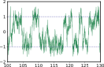

# Reservoir-Computing
A software package for the manuscript "Learning noise-induced transitions by multi-scaling reservoir computing".

Files have been categorized according to the name in the article. In each folder, a `.py` file corresponds to 6 `.npy` files: A, r, Wb, Wxi, Win, Woutpara. 
If a `.py` file runs, these `.npy` files should be put in the same path. The folder `1D bistable gradient system with white noise` can be a reference. 
Details are in `Example\Example.ipynb`.

System requirements: 
All simulations were done using Python.
The code requires Python >= 3.6 

--------------------------------------------------------------------------------------------------------------------------------------------

# Models
Users can easily input their model in `Model.py`, and we suggest to put it in a folder, because it would save 6 `.npy` files.

(1) Change the generate data in function "DoubleWell". To notice, in this function, 'dimensions' should be manually adjusted to match the data, and a RC parameter 
self.dimensions also need:

(2) dt, TrainLength and TestLength,  also could be adjusted, but need to make sure users could use them when generating data.

(3) Cycletime should be adjusted , and 2 swtiches also should be adjusted.
if Load=0, matrixs would rewrite, and Load=1 leads the `.py` file load the matrixs saved; Predict=0 makes `.py` file draw the deterministic part, to assist us in adjusting the hyperparameters, and Predict=1 plays the predicting phase. Usually, if Load=0, Predict should also equals 0.

(4) Hyperparameters to adjust are:

--------------------------------------------------------------------------------------------------------------------------------------------
```
rcpara=np.zeros(5)  
rcpara[0]=4      #K_{in}
rcpara[1]=4      #D
rcpara[2]=4000   #relevant to rho
rcpara[3]=0.2    #alpha
rcpara[4]=1e-8   #beta
```
--------------------------------------------------------------------------------------------------------------------------------------------
(5) Parameter N (self.N) is also can be adjusted.

## Note:
There is no evaluation in `Model.py`. If users need it, please copy it in file `distribution.py`, and use `1D bistable gradient system with white noise/doublewell.py` as a reference.
This code is only available for 1D bistable system, and for 2D bistable system, it could be found in the corresponding folder.

# Examples
Examples are given in main text, and there are some special circumstances:

(1) For the tilted bistable system, we need two suitable sets of hyperparameters to capture two different types transitions (upward and downward). 
So in each 'tilted' folders, 2 `.py` files are given with 12 `.npy` files. 'up' means upward transitions and 'down' means downward transitions.

(2) For the 1D bistable gradient system with colored noise, there are 4 `.py` files and lots of `.npy` files. `RC for deterministic.py` is to train the matrix $W_{out}$ and save the matrixs for RC (training phase), `RC for noise.py` is to learn noise seperate in `RC for deterministic.py`, and `Total.py` is to do rolling predition with the trained $W_{out}$ and noise learnt in `RC for noise.py`. `draw.py` is to draw the results in `Total.py`, but when `Total.py` runs, results would also give.

(3) For the Real data of protein folding with bistable state, the evaluation is seperated in `distribution.py`. 
In `real.py`, model for training set is imported from `datafordistribution.npy`, and result of rolling predition is saved as `predicted.npy`. These two files are for `distribution.py`.

--------------------------------------------------------------------------------------------------------------------------------------------

# Inputs
For example, in `1D bistable gradient system with white noise/doublewell.py`, at the beginning, figure of the training set is shown:

;


If two switches Load=0 and Predict=0, fugure of the deterministic part would be illustrated:


If Load=1 and Predict=0, figures of the deterministic part and the noise distribution between true and separated would be illustrated:


If Load=1 and Predict=1, figures of the predicted data, the noise distribution between true and separated and evaluations of transitions would be illustrated:




--------------------------------------------------------------------------------------------------------------------------------------------

If you have any questions or need help to implement your model, feel free to contact us.

Contact: Ying Tang, jamestang23@gmail.com;


